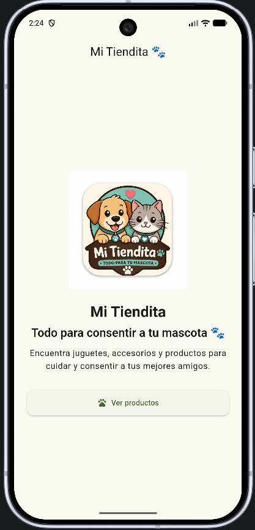
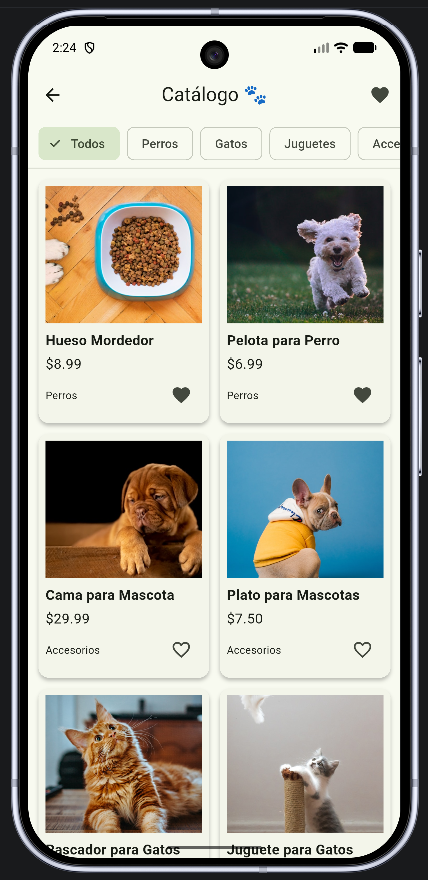
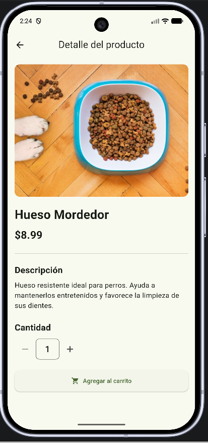
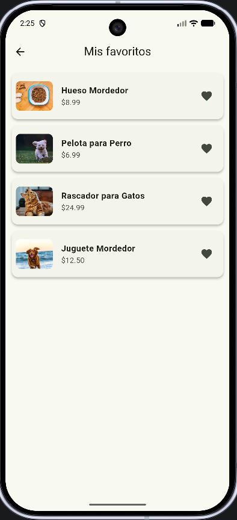

# 🐾 Mi Tiendita

**Autor: Freddy Paredes**

Aplicación móvil desarrollada en Flutter como continuación de las actividades integradoras anteriores.

El proyecto inició con la aplicación **Mi Mascota** y evolucionó hacia **Mi Tiendita**, una aplicación orientada a la visualización y gestión de productos para mascotas.

---

# 📱 Proyecto 3 – Gestión de estado con Provider

En esta tercera actividad se incorporó el manejo de estado mediante el patrón **Provider**, manteniendo y mejorando las funcionalidades desarrolladas anteriormente.

La aplicación permite visualizar productos, consultar su detalle, seleccionar categorías y administrar productos favoritos.

---

## 🎯 Objetivo

Aplicar los conocimientos de Flutter relacionados con:

- Manejo de estado mediante `Provider`.
- Uso de `ChangeNotifier`.
- Actualización reactiva de la interfaz.
- Creación de widgets reutilizables.
- Organización del proyecto en diferentes archivos y carpetas.
- Navegación entre pantallas.
- Persistencia de información utilizando `SharedPreferences`.
- Control de versiones mediante Git y GitHub.

---

# ✨ Funcionalidades

La aplicación cuenta con las siguientes funcionalidades:

- 🏠 Pantalla de inicio.
- 🛍️ Catálogo de productos.
- 🐶🐱 Filtrado de productos por categoría.
- 🔎 Visualización del detalle de cada producto.
- ❤️ Agregar productos a favoritos.
- 💔 Eliminar productos de favoritos.
- 📋 Visualización de la lista de favoritos.
- 💾 Persistencia de favoritos mediante `SharedPreferences`.
- 🔄 Actualización automática de favoritos utilizando `Provider`.
- 📱 Navegación entre diferentes pantallas.
- 🖼️ Visualización de imágenes de los productos.
- 🔔 Mensajes mediante `SnackBar`.
- 🔢 Cambio de cantidad de productos.
- 🐾 Logotipo relacionado con mascotas.
- 📱 Ícono personalizado de la aplicación.
- 🎨 Personalización visual de la interfaz.

---

# 🧩 Manejo de estado con Provider

Para esta actividad se incorporó el paquete **Provider** para administrar el estado de los productos favoritos.

El estado principal se encuentra en:

```text
lib/providers/favoritos_provider.dart

```dart
class FavoritosProvider extends ChangeNotifier {
  ...
}

El Provider permite agregar, eliminar y consultar productos favoritos. Además, utiliza notifyListeners() para actualizar automáticamente las pantallas que dependen de este estado.

🔄 Funcionamiento del Provider

El estado de favoritos se comparte entre las diferentes pantallas de la aplicación.

Cuando el usuario agrega o elimina un producto de favoritos:

Se modifica la lista de favoritos.
Se guarda la información utilizando SharedPreferences.
Se ejecuta notifyListeners().
Las pantallas que utilizan Consumer<FavoritosProvider> reciben el cambio.
La información se actualiza sin necesidad de reiniciar la aplicación.

De esta manera, un producto marcado como favorito desde el catálogo también aparece actualizado en la pantalla de favoritos.

🧱 Widgets reutilizables

Como parte de la organización del proyecto se crearon widgets reutilizables en archivos independientes.

❤️ Botón de favoritos

Archivo:

lib/widgets/boton_favorito.dart

Este widget permite agregar o quitar un producto de favoritos y utiliza Consumer<FavoritosProvider> para reflejar inmediatamente el estado actual.

🛍️ Tarjeta de producto

Archivo:

lib/widgets/tarjeta_producto.dart

Este widget representa cada producto dentro del catálogo.

Recibe la información del producto y permite reutilizar la misma estructura visual para todos los productos de la aplicación.

🧩 Modelo de datos

La aplicación utiliza una clase modelo para representar los productos.

Archivo:

lib/modelos/producto.dart

El modelo Producto contiene la información necesaria para mostrar cada producto, como:

ID
Nombre
Precio
Categoría
Imagen
Descripción

Esto permite mantener organizada la información y facilitar su utilización en las diferentes pantallas.

🗂️ Estructura del proyecto

La aplicación está organizada en diferentes carpetas para separar las responsabilidades:

lib/
├── capturas/
├── data/
├── modelos/
│   └── producto.dart
├── pantallas/
│   ├── catalogo.dart
│   ├── detalle_producto.dart
│   ├── favoritos.dart
│   └── inicio.dart
├── providers/
│   └── favoritos_provider.dart
├── servicios/
├── widgets/
│   ├── boton_favorito.dart
│   └── tarjeta_producto.dart
└── main.dart

Esta estructura permite mantener el código organizado y facilita su mantenimiento y ampliación.

▶️ Ejecución del proyecto

Para ejecutar la aplicación se requiere tener instalado Flutter.

Clonar el repositorio:

git clone https://github.com/frparedes/MI_TIENDITA.git

Ingresar al proyecto:

cd MI_TIENDITA

Instalar las dependencias:

flutter pub get

Ejecutar la aplicación:

flutter run

También es posible ejecutar el proyecto desde Visual Studio Code seleccionando un dispositivo o emulador compatible.


🔄 Evidencia del uso de Provider

El manejo de estado con Provider puede observarse principalmente en el funcionamiento de favoritos.

Al seleccionar el botón de corazón de un producto desde el catálogo, el estado cambia y el producto pasa a formar parte de la lista de favoritos.

La pantalla de favoritos utiliza el mismo estado administrado por FavoritosProvider, por lo que el cambio realizado desde otra pantalla se refleja automáticamente.

Además, los favoritos se almacenan mediante SharedPreferences, permitiendo conservar la información cuando la aplicación vuelve a iniciarse.

📦 Paquetes utilizados

Los principales paquetes utilizados en el proyecto son:

Flutter Material: componentes y diseño de la aplicación.
Provider: administración del estado.
SharedPreferences: almacenamiento local de los favoritos.
📱 Navegación

La aplicación cuenta con diferentes pantallas relacionadas entre sí:

Inicio: pantalla principal de la aplicación.
Catálogo: muestra los productos disponibles y permite filtrarlos por categoría.
Detalle del producto: muestra información específica del producto seleccionado.
Favoritos: muestra los productos que el usuario ha marcado como favoritos.

La navegación entre pantallas se realiza mediante Navigator.push() y Navigator.pop().

⭐ Características principales
Catálogo de productos.
Filtrado por categorías.
Visualización del detalle de cada producto.
Sistema de favoritos.
Persistencia de favoritos mediante SharedPreferences.
Manejo de estado mediante Provider.
Widgets reutilizables.
Modelo de datos para los productos.
Navegación entre diferentes pantallas.
Interfaz visual adaptada a la aplicación.
Uso de imágenes e iconos.
Actualización dinámica de la información.

# 📸 Capturas de pantalla

A continuación se presentan las principales pantallas de la aplicación.

## 🏠 Pantalla de inicio



---

## 🛍️ Catálogo de productos



---

## 🔎 Detalle del producto



---

## ❤️ Mis favoritos



👨‍💻 Autor

Freddy Paredes

Proyecto desarrollado como parte de la actividad integradora de Flutter.

📌 Repositorio

El código fuente del proyecto se encuentra disponible en GitHub:

https://github.com/frparedes/MI_TIENDITA